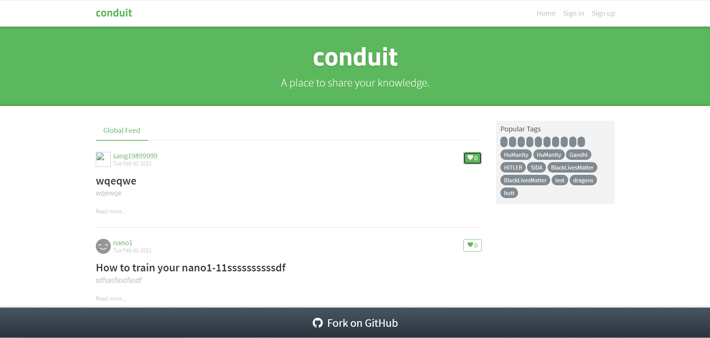
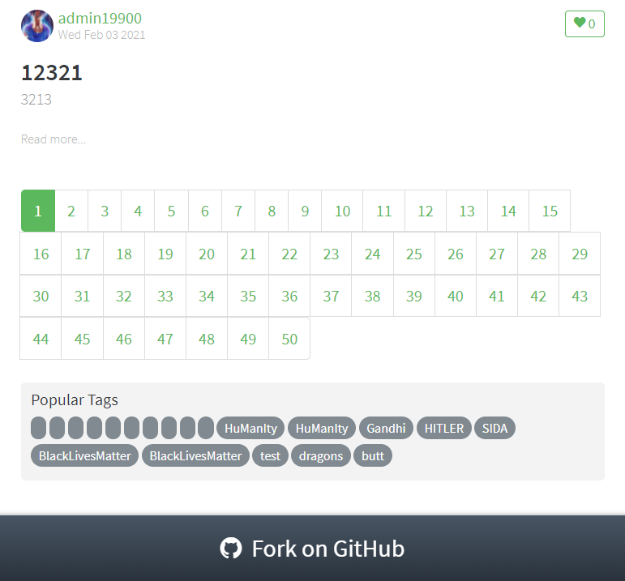
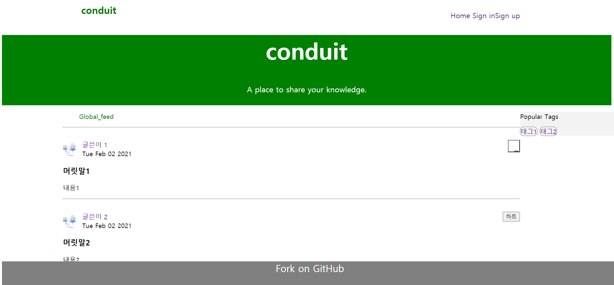
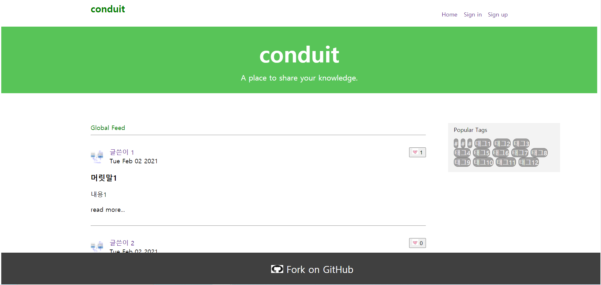
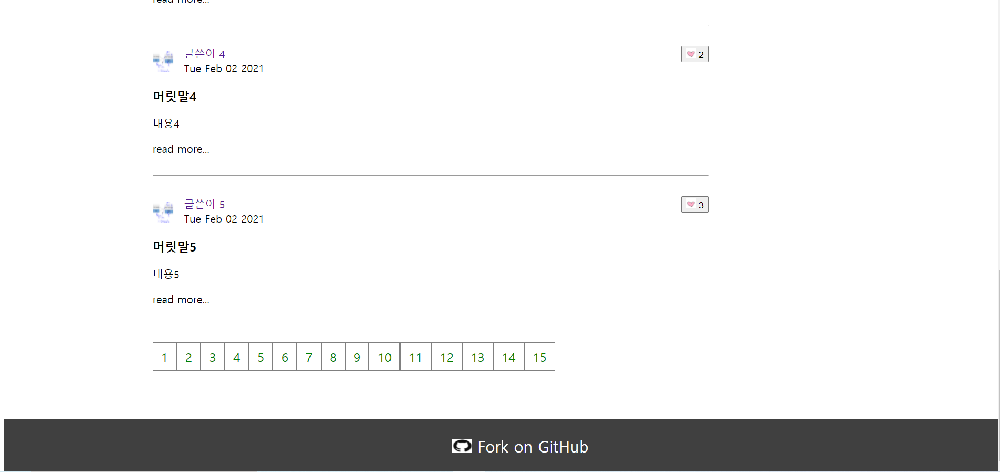
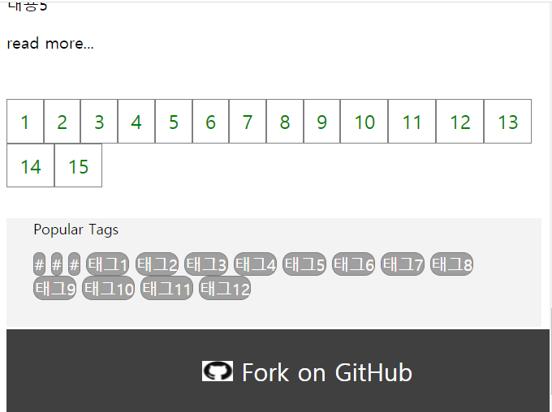

# realworld-html-css-demo-practice

 
realworld demo 게시판 페이지를 `html 및 css`를 적용해 정적 페이지를 구성하는 프로젝트입니다.

  

* 목표 LayOut 모습 1

   

* 목표 LayOut 모습 2

  

### 210202 진행상황

--- 

 

1. 전체 LayOut 구조 및 배치 파악
2. 부분 html 파일로 분리
3. HTML CSS 요소 분석 및 코드 작성

 

* 보완할 사항
1. 버튼 내부에 글씨와 그림 동시 배치
2. media query 이용해 동적으로 변화된 가로 너비에 따른 배치 파악 및 코드 수정

  

* LayOut  

   

### 210203 진행상황

---

 

1. 레이아웃 점검
2. media query 적용

 

* 보완할 사항
1. mouse 효과 파악 미흡
2. 코드 리팩토링 필요

  

* LayOut 기본 페이지

  

*  LayOut의 맨 아래 모습

   

*  width(가로 너비)를 줄였을 때 변화된 모습

 
 
### 느낀 점  

---

 

구조 및 배치 파악이 쉽지 않았습니다. 
1. 정적 페이지가 가로 너비에 따라 배치도가 달라진다는 점
2. 각 HTML 요소들 간의 관계 속에서 각 요소들의 의미를 정확히 파악해야 하는 점

 

파악이 쉽지 않다보니, 주먹구구식으로 코딩하는 경우가 많았습니다.  
중복 적용된 코드들도 많고, CSS 요소가 공통으로 적용된 경우들을 찾아서 분리를 시켜야 합니다.  

 
그래도 LayOut을 다양한 HTML 및 CSS 요소를 섞어 표현 할 수 있는 경험을 할 수 있어서 좋았습니다.
